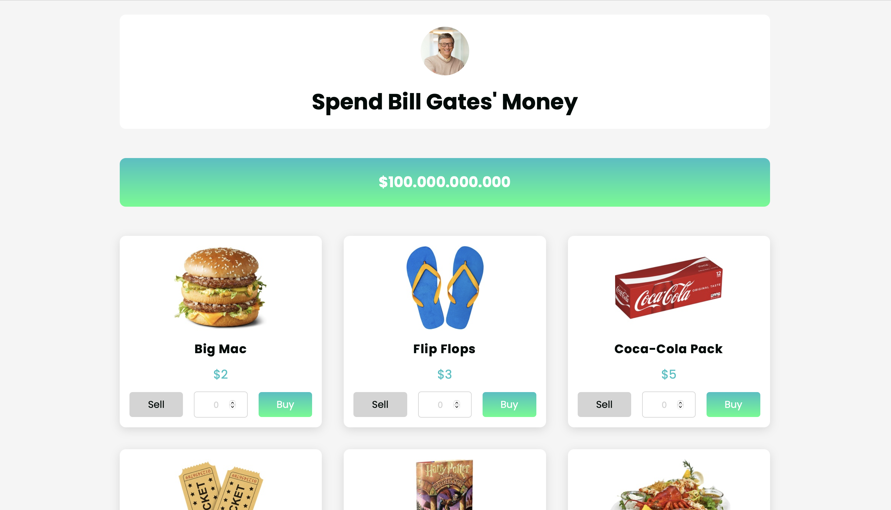

# Spend Bill Gates' Money - React Web Application

This project is a React web application where users can spend fictional money on various products, similar to the "Spend Bill Gates' Money" concept. The goal is to allow users to simulate spending large sums of money on a variety of items, with certain restrictions, such as only being able to buy certain products once.

## Table of Contents

- [Demo](#demo)
- [Features](#features)
- [Installation](#installation)
- [Usage](#usage)
- [Technologies](#technologies)

## Demo

You can check out the live demo of the application here: [Demo Link](https://precious-truffle-9624d4.netlify.app)



## Features

- Users start with a large sum of money and can spend it on various products.
- Products are displayed as cards with an image, title, and price.
- Each product can be bought in different quantities, and the total cost is deducted from the available money.
- Some products, like the "Mona Lisa," can only be purchased once, and after buying, the **Buy** button is disabled.
- Users can also sell products and reclaim part of the money.
- Real-time updates to the amount of money and purchased products.
- Responsive design

## Installation

To run this project locally, follow these steps:

1. **Clone the repository:**

```bash
git clone https://github.com/ozgurdayanir/bill-gates.git
```

3. **Move to the project file:**

```bash
cd bill-gates
```

2. **Install the dependencies:**

Make sure you have Node.js installed, and run:
```bash
npm install
```
3. **Start the development server:**

```bash
npm run dev
```

## Usage

- Upon opening the application, users will see a starting amount of money (e.g., $100 billion).
- Each product can be purchased by clicking the Buy button. The available money will decrease based on the product's price.
- The Sell button allows users to sell products they have purchased and regain some money.
- If a product is restricted to one purchase (e.g., "Mona Lisa"), the Buy button will be disabled after purchasing it.
- Input fields allow users to adjust quantities manually before making purchases.

## Technologies

- **React** - A JavaScript library for building user interfaces.
- **JavaScript (ES6+)** - For application logic.
- **CSS** - For styling the components.
- **HTML** - Structure of the web pages.

## Possible Improvements:

- A sell all products button can be added to remove all purchased products from the receipt.

- A delete button can also be added to remove only the desired product from the receipt.
